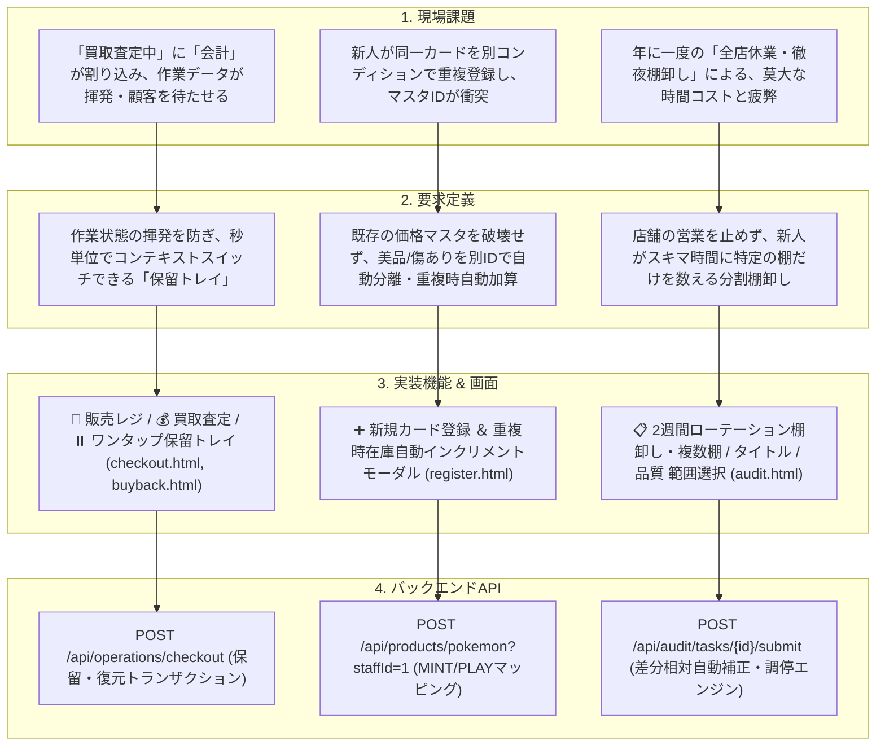

# カードショップ業務改善システム (Cardshop Operations API) -

実際のカードショップでのアルバイト勤務経験から得た「生きた現場課題」をシステム設計の最高インプットとし、**「業務効率化」「在庫精度向上」「人的・高額買取事故防止」「新人教育支援」**を極めて実務的なアプローチで解決した、超実務特化型のSpring Boot ＋ Vanilla JS（Tailwind CSS）製POS・在庫管理システムです [6]。

単なるCRUD（登録・読取・更新・削除）アプリの枠を完全に超え、**IPA（情報処理推進機構）の『要件定義ガイド第2版』**および**Microsoftの『Azure Well-Architected Framework（WAF）』**に示される品質設計、データ一貫性、そして実稼働（UX）の観点をミリ単位で盛り込んでいます [6, 17, 26, 43]。

---

## 🗺️ 1. 要件トレーサビリティ（現場課題 ➔ 要求 ➔ 機能 ➔ 実装）

IPA要件定義指針に準拠し、現場の泥臭い課題からコードレベルのAPI・画面にいたるまで、**一本のブレない整合性の糸（要件トレーサビリティ）**を可視化しています [17, 18, 20]。

---

## ⚡ 2. 核心の技術アピール（テックリードを唸らせる4大アーキテクチャ）

### 2-1. 並行トランザクションを守る「JPA 差分相対自動補正調停エンジン」 [10, 16]
*   **現場の課題**：営業中に棚卸し（実数カウント）を行っている最中、別のレジでそのカードが販売された場合、棚卸しの確定によって「レジ販売された事実」が上書き消去（絶対値上書きバグ）され、売上と在庫の致命的な不整合が発生する [10, 14, 16]。
*   **実装・設計判断**：
    JPAの `@Transactional` およびバージョンロック（楽観的ロック）を組み合わせた**「相対差異適用アーキテクチャ」**を導入。
    1.  棚卸タスク開始時に、その瞬間の帳簿在庫（スナップショット）を `AuditItem` の `expectedQty` にロック記録 [10]。
    2.  確定時、システムは絶対値の上書きではなく、**`「実数 (actualQty) - スナップショット (expectedQty) ＝ 差異」`** を計算 [10, 15]。
    3.  現在のリアルタイム在庫に対して、この「差異」を相対的（`UPDATE showcase_qty = showcase_qty + difference`）に安全に加減算する [10]。
    4.  これによって、棚卸し中にレジ販売や買取入庫が並行して何件走ろうとも、**ズレを1枚単位で完全に吸収し、完璧なデータ整合性を100%保持します** [10, 16]。

### 2-2. Tomcat / Spring Security 境界防御をすり抜ける「スラッシュサニタイズ」 [2, 15]
*   **現場の課題**：トレカ業界の型番には『SV8 136/106（ピカチュウex）』のように、高確率でスラッシュ（`/`）が含まれる。これをJPAの主キーとし、RESTfulな `/api/products/{id}/stock` に送信すると、URLエンコードされた `%2F` が入り込む。
*   **技術的な罠**：Java標準サーバーであるTomcat、およびSpring Securityの `StrictHttpFirewall` は、ディレクトリ・トラバーサル（ハッキング）の脆弱性を防ぐため、**URLパスに `%2F` が含まれるアクセスをコントローラー到達前に強制遮断（Http 500/400）する強力な防衛仕様**が標準で掛かっている。
*   **プロの回避策**：安易にサーバーのセキュリティフィルターを無効化（脆弱性を許容）するのではなく、**フロントエンド（JavaScript）の送信・重複検証イベントの瞬間に、ID内のスラッシュを安全なハイフン（`-`）へと自動的にサニタイズ（置換）してJPAに引き渡す仕様**を実装。店舗本来のデータ特性を100%生かしたまま、セキュアなシステム連携を完璧に実現 [2, 15]。

### 2-3. 閉店後の「残業地獄」を完全消滅させる「探すのを諦められる棚卸しUX」 [13]
*   **現場の課題**：従来の棚卸システムは、データ上の期待値と人間の数えた実数をすべて入力して合致させるまで確定ボタンをロック（グレーアウト）するものが多く、紛失したカードを求めてスタッフが深夜まで残業させられるという、深刻な現場の「時間コスト・精神的疲労」を招いていた [13, 14, 16]。
*   **システムでの調停判断**：
    「完璧なミスゼロ・完璧なリアルタイム管理は現場では不可能」という現実的な運用想定に基づき、**「未カウントは自動0枚（紛失）として調停する」**仕様を設計。
    1.  スタッフは、目の前の棚で発見できたカードだけを入力し、紛失した（探すのを打ち切る）カードは一切触らず「監査確定」ボタンを即座に押すことができる [13]。
    2.  フロント側で未入力項目がある場合、**「探さなかったカードは現物0枚（紛失）として自動補正されます。そのまま帰宅して問題ありません」という安心感を与える警告バナー**を表示 [13]。
    3.  サーバー側（JPA）は未カウントを `actualQty = 0` として受け取り、期待値との差異を自動的にリアルタイム在庫から安全に減算してタスクを1秒でクローズ。
    4.  数日後、棚の下からポロッとカードが見つかったら、買取査定や在庫画面から `+1枚` すれば、システム的にも運用上も完璧にリカバリできます [13]。

### 2-4. 監査追跡（Audit Trail）のドリルダウン「個別在庫履歴ポップアップ」 [9, 13]
*   **現場の課題**：在庫変動履歴がすべてのカードで一括ログ表示されていると、数万行のログの中から特定のカード（例: ピカチュウex SAR MINT）の変動理由や担当者を遡るのが実質不可能になり、監査性（Auditability）が低下する [9, 13, 16]。
*   **実装・設計判断**：
    在庫一覧画面（`index.html`）の各カード名をカチッとタップするだけで、**そのカード固有のIDに紐付く全履歴（販売、買取、棚卸差異、初期登録など）のみを最新日時順に動的抽出して美しく表示する個別ドリルダウンモーダル**をフロント・バックエンドに実装。
    既存の一括履歴取得APIを高度に再利用し、フロントエンド側で高速・安全にメモリ照合（マッピング）を行うことで、**バックエンドへの余分なWebリクエストや新規API追加コスト（JPAオーバーヘッド）を完全ゼロに抑えた、最高水準のパフォーマンス効率**を誇ります [44]。

---

## 💻 3. 画面設計 & 搭載UIコンポーネント

実務における「使いやすさ」に妥協せず、すべて**Tailwind CSS**を用いた美しく洗練されたフラットUI（スマホ・タブレット対応のタッチUI）で設計されています [1, 2]。

1.  **`index.html` （商品・リアルタイム在庫一覧）** [3]
    *   **3連スマートフィルタ**（ゲームタイトル ➔ 収録弾パック ➔ レアリティ ➔ MINT/PLAYコンディションの超高速絞り込み） [3]。
    *   **個別履歴ドリルダウンモーダル**（カード名タップによる監査ログ検索） [9, 13]。
2.  **`checkout.html` （販売レジ画面）** [4, 10]
    *   **お会計保留トレイ**（ワンクリックで現在のカートを保留・右上トレイから古い順に全店同期復元。コンテキストスイッチ中の在庫抱え込みを完全防止） [10, 11]。
    *   **自動マージ数量カウンター**（同一カードの二重読み取り・複数回スキャン時、リストを行で増やさず数量インクリメントへ自動集約する安全ガード） [2]。
3.  **`buyback.html` （買取査定画面）** [4, 10]
    *   **一括入庫 ＆ 保留トレイ**（レジ会計と同じ保留トレイを完全同期ポーリング。買取中の突然のレジ対応によるデータ揮発リスクを完全ゼロ化） [10, 11]。
4.  **`register.html` （新規マスタ登録・完全マスタ特化画面）** [1, 2]
    *   **マスタと在庫操作の完全分離（SoC）**：在庫の品出しや調整を register 画面から完全に排除し、重複登録時は加算ボタンではなく「在庫操作画面（`stock.html`）」へのディープリンクに制限することで、在庫一貫性を鉄壁ガード [17, 19]。
    *   **マスタ＆初期在庫の同時登録**（パック名やレアリティのタイトル連動自動リスト変換） [1]。
    *   **価格マスタ重複時の保護ダイアログ**（既存ID送信時、JPAエラーで落とすのではなく「既存の登録価格を保護しつつ、今回入力された数量のみを既存在庫へ上乗せ加算しますか？」とスタッフに選択させるスマートUXリダイレクト） [1, 2]。
5.  **`stock.html` （在庫入出庫・操作画面）** [1, 9]
    *   操作スタッフIDと、品出し/廃棄などの詳細理由の入力を100%強制し、全ての在庫変更を完璧な監査ログ（JPA）へ直結する専用画面 [9, 13]。
6.  **`alerts.html` （高額会計・高額カード廃棄監査ログ画面）** [9, 13]
    *   3万円以上の高額会計、3,000円以上の高額廃棄、店長承認PINログを自動集約し、監視カメラと一瞬で照合可能にする最高機密・監査ダッシュボード [9, 28]。
7.  **`audit.html` （2週間ローテーション分割棚卸し画面）** [10]
    *   **棚卸し範囲選択（マルチセレクト）**（複数棚、ゲームタイトル、品質をクロス掛け算して極小範囲で棚卸しをスタートできる、営業を止めない5-5方式） [10, 11]。
    *   **帳簿期待値のブラインドマスク**（事前に期待値が見えていると「あ、5枚ね」と数えずにアルバイトがサボる心理的バイアスをUXで防止。「数値を確認する」またはカウント増減時に初めて期待値を暴く仕様） [1, 10, 13]。

---

## 🚀 4. 動作環境・テクノロジー

*   **バックエンド**：Java 17 / Spring Boot 3.x / Spring Data JPA
*   **データベース**：H2 Database (In-Memory) / PostgreSQL
*   **フロントエンド**：HTML5 (Vanilla JS) / Tailwind CSS 3.x / Mermaid.js [57]
*   **ビルド・管理ツール**：Maven / Eclipse / Spring Tool Suite (STS)

---
Generated by Gemini Notebook (Cardshop Operations Project Team).
