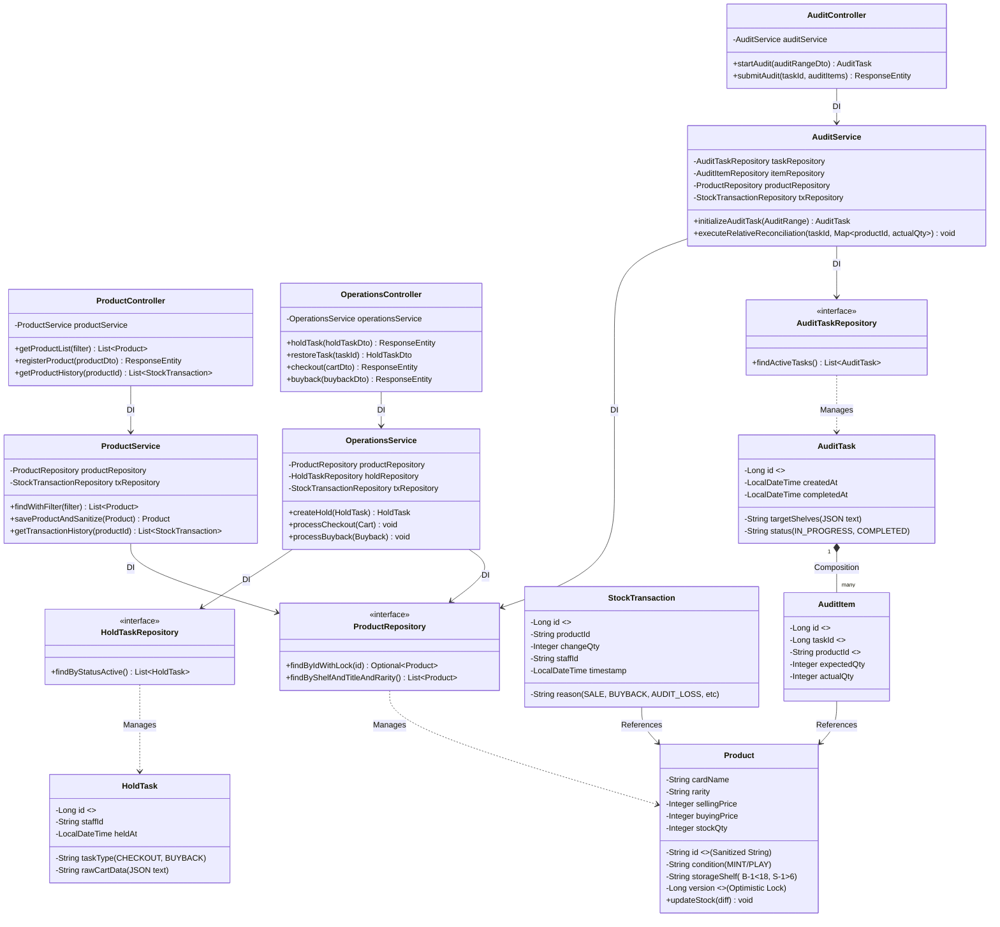

# 05_クラス図（Class Diagram）- Spring Boot 構成仕様（第55版）

JPAのデータ一貫性保証、およびVanilla JSフロントエンドとのRESTful通信を統制する、Spring Bootバックエンド（MVC三層アーキテクチャ）の厳密な設計クラス図です。

---

## 1. 🧬 クラス依存関係図（Mermaid）

---

## 2. 🏗️ クラス設計・アーキテクチャの解説

### 2-1. 疎結合の徹底（Web・ドメイン・データの三層分離）
*   **Controller層**：HTTPリクエストの受付、例外のハンドリング、およびDTOからEntityへの変換に特化させ、ビジネスロジックを一切持たせません。
*   **Service層**：すべてのビジネスルール、差分補正計算、およびトランザクション境界（`@Transactional`）を管轄します。
*   **Repository層**：Spring Data JPAを継承し、JPAプロバイダ（Hibernate）を介して安全なクエリを発行します。

### 2-2. データ整合性のための「ガードレール設計」
1.  **楽観的ロック（Optimistic Locking）**
    *   `Product` エンティティに `@Version` フィールド（`version`）を定義。
    *   在庫更新時の競合（ロストアップデート）を検知すると `ObjectOptimisticLockingFailureException` をスローし、データを自動保護します。
2.  **サニタイズ処理の委譲（SoC）**
    *   `ProductService` 内で、登録される商品ID（トレカ型番）のスラッシュをハイフンに置換（サニタイズ）してから永続化。セキュリティ上の脆弱性をサーバー境界で完全にブロックします。
